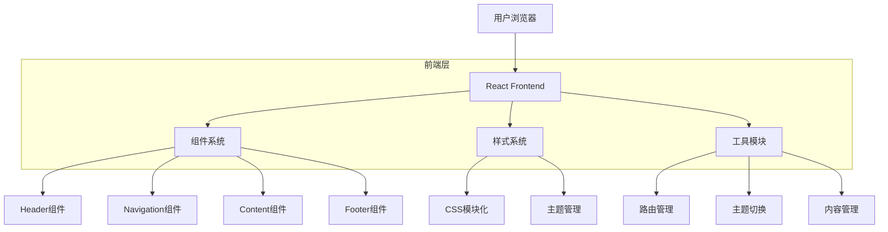

# 个人网站重构技术架构文档

## 1. 架构设计



## 2. 技术栈描述

- **前端框架**: React@18 + Vite
- **样式方案**: TailwindCSS@3 + CSS Modules
- **构建工具**: Vite
- **初始化工具**: vite-init
- **图标系统**: Lucide React
- **无后端依赖**: 纯静态网站部署

## 3. 文件结构规划

```
src/
├── components/          # 可复用组件
│   ├── layout/           # 布局组件
│   │   ├── Header.jsx
│   │   ├── Navigation.jsx
│   │   ├── Footer.jsx
│   │   └── Layout.jsx
│   ├── ui/               # UI组件
│   │   ├── Button.jsx
│   │   ├── Card.jsx
│   │   └── Typography.jsx
│   └── sections/         # 页面区块
│       ├── Hero.jsx
│       ├── About.jsx
│       ├── Projects.jsx
│       └── Contact.jsx
├── pages/               # 页面组件
│   ├── Home.jsx
│   ├── Blogs.jsx
│   ├── Projects.jsx
│   └── Misc.jsx
├── styles/              # 样式文件
│   ├── globals.css
│   ├── components.css
│   └── themes.css
├── utils/               # 工具函数
│   ├── content.js
│   ├── theme.js
│   └── constants.js
├── data/                # 静态数据
│   ├── projects.json
│   ├── blogs.json
│   └── personal.json
└── App.jsx
```

## 4. 组件架构设计

### 4.1 核心组件

**Layout组件**
- 统一页面布局结构
- 管理主题切换状态
- 处理响应式布局

**Navigation组件**
- 侧边栏导航
- 移动端适配
- 当前页面高亮

**Content组件**
- 动态内容渲染
- 页面切换动画
- 内容懒加载

### 4.2 组件通信
- 使用React Context管理全局状态（主题、语言等）
- 使用props进行父子组件通信
- 使用自定义hooks提取逻辑

## 5. 样式系统设计

### 5.1 设计原则
- **极简主义**: 黑白灰主色调，单一强调色
- **清晰层次**: 通过字体大小、粗细区分信息层级
- **充足留白**: 提升内容可读性
- **一致间距**: 使用8px网格系统

### 5.2 色彩方案
```css
/* 主色调 */
--primary: #000000;      /* 黑色 */
--secondary: #ffffff;      /* 白色 */
--accent: #2563eb;       /* 蓝色强调色 */
--gray-100: #f3f4f6;     /* 浅灰 */
--gray-200: #e5e7eb;     /* 中灰 */
--gray-800: #1f2937;     /* 深灰 */

/* 暗黑模式 */
--dark-bg: #0a0a0a;
--dark-text: #e5e5e5;
--dark-border: #262626;
```

### 5.3 字体系统
```css
/* 字体栈 */
--font-sans: -apple-system, BlinkMacSystemFont, "Segoe UI", Roboto, "Helvetica Neue", Arial, sans-serif;
--font-mono: "SF Mono", Monaco, "Cascadia Code", "Roboto Mono", Consolas, monospace;

/* 字体大小 */
--text-xs: 0.75rem;      /* 12px */
--text-sm: 0.875rem;     /* 14px */
--text-base: 1rem;       /* 16px */
--text-lg: 1.125rem;     /* 18px */
--text-xl: 1.25rem;      /* 20px */
--text-2xl: 1.5rem;      /* 24px */
--text-3xl: 1.875rem;    /* 30px */
```

## 6. 内容管理

### 6.1 数据结构设计
```javascript
// 项目数据
const projects = [
  {
    id: "project-1",
    title: "项目名称",
    description: "项目描述",
    technologies: ["React", "TypeScript"],
    link: "https://github.com/...",
    status: "completed"
  }
];

// 博客数据
const blogs = [
  {
    id: "blog-1",
    title: "文章标题",
    excerpt: "文章摘要",
    date: "2024-01-01",
    tags: ["技术", "思考"],
    readTime: "5 min read"
  }
];
```

### 6.2 内容加载策略
- 静态JSON数据直接导入
- 图片资源使用懒加载
- 内容分页和虚拟滚动

## 7. 性能优化

### 7.1 构建优化
- 代码分割和懒加载
- 图片压缩和WebP格式
- CSS和JS压缩
- 字体子集化

### 7.2 运行时优化
- 组件懒加载
- 图片懒加载
- 缓存策略
- 防抖节流

## 8. 部署方案

### 8.1 构建输出
- 生成静态HTML、CSS、JS文件
- 支持GitHub Pages部署
- 支持Netlify/Vercel一键部署

### 8.2 SEO优化
- 预渲染或SSR
- Meta标签优化
- Sitemap生成
- Open Graph支持

## 9. 开发规范

### 9.1 代码规范
- 使用ESLint和Prettier
- 遵循React最佳实践
- 组件命名使用PascalCase
- 文件命名使用camelCase

### 9.2 Git规范
- 使用Conventional Commits
- 功能分支开发
- 代码审查流程

## 10. 扩展性考虑

### 10.1 功能扩展
- 易于添加新页面和功能
- 插件化架构支持
- 主题系统可扩展

### 10.2 技术升级
- 平滑升级到React新版本
- 支持TypeScript迁移
- 易于集成新工具和库